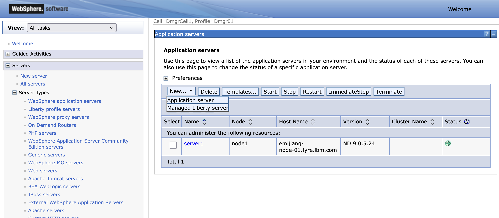
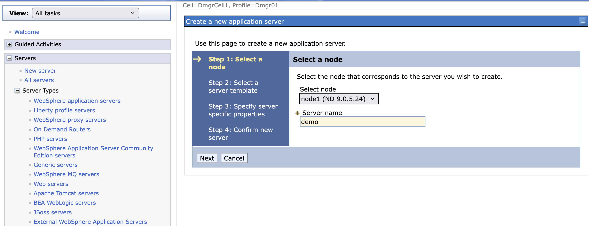
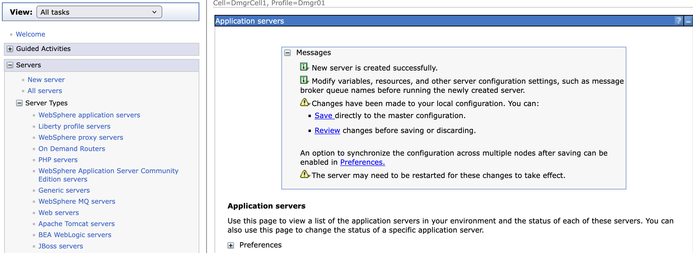
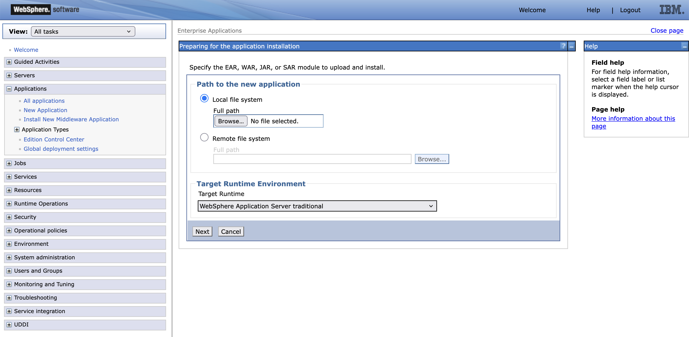
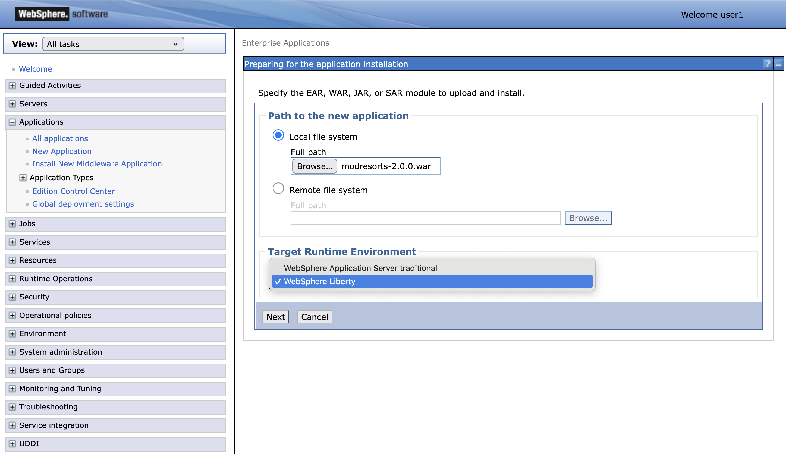

# Introduction for IBM Modernized Runtime Extension for Java 

Table of Contents

1. [Introduction](#introduction)  
   
2. [Getting started](#getting-started)  
   2.1 [Lab environment overview](#lab-environment-overview)  

3. [Deploy apps to a Managed Liberty Server](#deploy-apps-to-a-managed-liberty-server) 

4. [Deploy apps to a Managed Liberty Server cluster](#deploy-apps-to-a-managed-liberty-server-cluster)

# Introduction

[IBM Modernized Runtime Extension for Java](https://www.ibm.com/docs/en/more) (MoRE) is an extension of WebSphere® Application Server Network Deployment (ND) 9.0.5 that enables you to run and manage Liberty servers from the traditional WebSphere environment. With MoRE, Liberty servers can be configured, clustered, and administered using familiar tools like the administrative console and wsadmin scripting.

## About this lab

In this interactive, hands-on lab, you'll explore the cutting-edge capabilities of WebSphere Application Server and MoRE—tools designed to supercharge your modernization journey. 

Through guided modules, you'll deploy modern Jakarta EE and Spring Framework applications to a Liberty server or cluster, using the WebSphere Administrative Console and/or automation with wsadmin scripts. Whether you're modernizing legacy systems or building cloud-native apps, this lab is your launchpad into the next generation of enterprise application management.

---
# Getting started

This section guides you through the initial setup of the lab environment. Perform all tasks from the student virtual machine.

## Lab environment overview

The lab environment is preinstalled with the following packages:

* WebSphere Application Server Network Deployment (ND), version 9.0.5.24, running on Java SE 8

    * Modernized Runtime Extension for Java (MoRE), version 1.0.0.1

* WebSphere Liberty, version 24.0.0.6, running on Java SE 17

In addition, the environment is preconfigured with the following profiles and server instances:

* A Deployment Manager (`dmgr`), which serves as the central controller for the WebSphere cell.
## Create a Managed Liberty Server
After the instllation, follow this steps to create a Managed Liberty Server `demo`.
1.  Launch the **WAS Admin Console** by selecting it from your browser bookmarks or navigating to the https://localhost:9043/ibm/console URL.
2. Go to **Servers** &rarr; **Server Types** &rarr; **WebSphere Application Servers** &rarr;<ins>New...</ins>.

3. In the `Application servers` panel,  
* Under **New...**, select **Managed Liberty server** and type `demo` under the `Server name` textbox.

4. Click **Next** on Step 2 and 3.
5. Click **Finish** on Step 4.
6. Click **Save** on the displayed message.

The next step is to deploy applications to the created Managed Liberty server.

# Deploy apps to a Managed Liberty Server
After you have completed the installation, it is time to deploy Jakarta EE 10 or Spring Framework 6.x apps to your Managed Liberty Servers. This downloads contains a couple of apps to help you get started.
## A Jakarta EE 10 application
The app [modResort](https://github.com/WASdev/more-techXchange-lab/releases/download/0.0.1/modresorts-2.0.0.war) utilises Jakarta EE 10 technologies. Clicking the above link to the app to download this war to your local system.

### Installing the application WAR file

1. Launch the **WAS Admin Console** by selecting it from your browser bookmarks or navigating to the https://localhost:9043/ibm/console URL.

2. Go to **Applications** &rarr; **New Application** &rarr; <ins>New Enterprise Application</ins>.

   

3. In the installation panel:

   * Under **Path to new application**, select **Local file system** and choose the WAR file `modresorts-2.0.0.war` downloaded earlier.
   * Set **Target Runtime Environment** to `WebSphere Liberty`
   
   Click **Next** and wait for the application to upload.

4. Choose **Fast Path** and click **Next**.

5. Leave **Step 1** unchanged and click **Next**.

6. On **Step 2**, map the application module:

   * Under **Cluster and servers**, select the server `demo`.

   * Check the box next to `modresorts-2.0.0.war` and click **Apply**.

   * Confirm that the server `demo` is listed under the **Server** column for the `modresorts-2.0.0.war` module.
   
   Click **Next**.

7. On **Step 3**, confirm that the **Context Root** is set to `/resorts` and click **Next**.

8. On **Step 4**, review the installation summary and click **Finish**.

9. After the installation completes, click <ins>Review</ins>. 
   
   Select **Synchronize changes with Nodes**, and click **Save**. Click **OK** when synchronization is complete.
10. Start the Managed Liberty server `demo`, by following the following instructions.
   * Go to **Servers** &rarr; **Server Types** &rarr; **WebSphere Application Servers** &rarr;
   * Click on the checkbox next to `demo` and click on `Start` button. 
   
   Both the server and the app should be started.
11. Try out the application
   * On a terminal window, go the `demo` MLS and then display `console.log` e.g. (cat /opt/IBM/WASND/profiles/AppSrv01/managedLiberty/usr/servers/demo/logs/console.log). 
   * Find the endpoint for the `ModResort` e.g. `http://9.46.96.145:9081/resorts/`. The following should be displayed.
   

## A Spring Framework 6.x application
The app [Spring Petclinic](https://github.com/WASdev/more-techXchange-lab/releases/download/0.0.1/spring-petclinic-3.5.0-SNAPSHOT.war) utilises Spring Framework 6.x and Jakarta EE 10 technologies.

You can use the same steps as documented above to install this application.

## Deploy apps to a Managed Liberty Server cluster

Follow [this instruction](https://github.com/WASdev/more-techXchange-lab/blob/main/README.md) to deploy applications to a Managed Liberty Server cluster.
